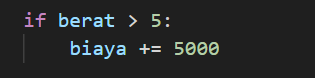

# Meenghitung Biaya Pengiriman Barang

Fungsi ini untuk menghitung biaya pengiriman dengan beberapa faktor yakni berat barang, jarak, layanan ekspres, dan status keanggotaan. menggunakan parameter seperti berat, berat barang dalam kilogram.
jarak, jarak pengiriman dalam kilometer.
express,  jika iya, berarti menggunakan layanan ekspres yang lebih mahal.
member, jika iya, berarti pelanggan adalah anggota dan mendapatkan diskon. Program akan dimulai dengan biaya awal sebesar Rp10.000. biaya akan berubah sesuai dari berat, jarak, ekspres, atau keanggotaan.:

If jika berat barang lebih dari 5kg maka akan dikenakan biaya tambahan sebesar Rp5.000. misal harga tadinya 10k menjadi 15k. jika tidak lebih tidak dikenakan biaya.:

If jika jarak pengiriman lebih dari 10 km, maka biaya akan dikenakan tambahan sebesar Rp8.000.
misal yang tadinya 10k menjadi 18k. Jika jarak kurang dari 10 km, tidak akan ada biaya tambahan.:

If pilihan express jika pengguna memilih layanan ekspress, maka biaya tambahan sebesar Rp20.000 akan dikenakan. Jika express=False, tidak akan ada biaya tambahan.:

If pilihan keanggotaan/member. jika pelanggan adalah anggota (member=True), mereka mendapatkan diskon 10%. diskon dihitun dengan mengalikan biaya dengan 0.9.
Jika member=False, tidak ada diskon.

Fungsi mengembalikan biaya dalam bentuk bilangan bulat. Jika hasilnya desimal, angka desimal akan dibulatkan ke bawah.:

Lalu hasil dari program akan diprint berdasaarkan berat, jarak, express, member.:

Input

Output
